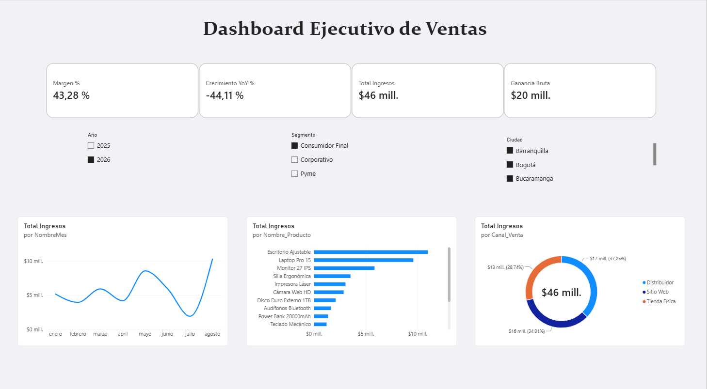

# Executive Sales & Profitability Dashboard | Power BI & Python



## 📌 Resumen del Proyecto
Este proyecto presenta un panel interactivo de control ejecutivo diseñado en **Power BI** para analizar la tendencia de ventas, la rentabilidad financiera y el rendimiento por canal comercial. Los datos fueron simulados en **Python** para recrear un entorno corporativo multicanal con más de 1.500 registros transaccionales.

---

## 🛠️ Arquitectura y Tecnologías
- **Power BI Desktop:** Modelado de datos, DAX avanzado y diseño de interfaz UI/UX.
- **Python (Pandas & NumPy):** Generación y estructuración sintética de datasets (ETL).
- **Modelo Relacional:** Esquema en Estrella (*Star Schema*) con relaciones 1:N y tabla de calendario dedicada (`Dim_Calendario`).
- **DAX (Data Analysis Expressions):** Creación de medidas dinámicas de rentabilidad e inteligencia de tiempo (*Year-over-Year*).

---

## 📊 Modelo de Datos (Star Schema)
El modelo relacional integra la tabla de hechos con sus dimensiones correspondientes para optimizar la velocidad de cálculo:

- **`Fact_Ventas`**: Registros transaccionales (Fecha, ID_Cliente, ID_Producto, Cantidad, Canal_Venta).
- **`Dim_Productos`**: Detalle de productos, categorías, costo unitario y precio de venta.
- **`Dim_Clientes`**: Segmento de clientes y ubicación geográfica.
- **`Dim_Calendario`**: Tabla de tiempo dedicada generada en DAX para filtros temporales e inteligencia de tiempo.

---

## 🧮 Lógica de Negocio y Medidas DAX Clave

### 1. Total Ingresos
```dax
Total Ingresos = 
SUMX(
    Fact_Ventas,
    Fact_Ventas[Cantidad] * RELATED(Dim_Productos[Precio_Venta])
)
```

### 2. Ganancia Bruta
```dax
Ganancia Bruta = 
[Total Ingresos] - 
SUMX(
    Fact_Ventas,
    Fact_Ventas[Cantidad] * RELATED(Dim_Productos[Costo_Unitario])
)
```

### 3. Crecimiento Interanual (YoY %)
```dax
Ingresos Año Anterior = 
CALCULATE(
    [Total Ingresos],
    SAMEPERIODLASTYEAR(Dim_Calendario[Date])
)

Crecimiento YoY % = 
DIVIDE(
    [Total Ingresos] - [Ingresos Año Anterior],
    [Ingresos Año Anterior],
    0
)
```

---

## 💡 Insights de Negocio
1. **Rendimiento Financiero:** Margen bruto consolidado mantenido sobre el **42.3%**, demostrando alta eficiencia operativa en la combinación de productos.
2. **Distribución por Canal:** Balance equilibrado en la facturación con liderazgo del canal *Sitio Web* (~38.8%), seguido por *Distribuidor* (~36.5%) y *Tienda Física* (~24.5%).
3. **Tendencia Temporal:** Se identifica estacionalidad con picos de ventas durante el primer trimestre del año y desaceleración progresiva hacia el segundo semestre.

---

## 🚀 Cómo Replicar este Proyecto
1. Clona este repositorio:
   ```bash
   git clone [https://github.com/Daniii-a/Power-BI-Sales-Dashboard.git](https://github.com/Daniii-a/Power-BI-Sales-Dashboard.git)
   ```
2. Abre el archivo `Dashboard_Ventas.pbix` en **Power BI Desktop**.
3. (Opcional) Revisa el script en `scripts/` para modificar las reglas de simulación de datos en Python.
